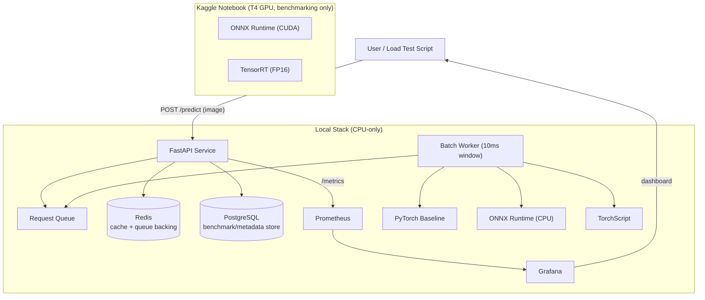

# InferBench

A self-serve model-inference optimization and observability platform. Upload
a model, get back a benchmarked, monitored inference endpoint, with real
before/after latency numbers across PyTorch, ONNX Runtime, and
TensorRT/TorchScript.

This build serves `google/vit-base-patch16-224` (ViT-Base), benchmarked on
both GPU (Kaggle T4) and CPU (local), and served through a FastAPI backend
with a dynamic batching layer built from scratch.


[](https://github.com/alyrraza/inference-benchmark-mlops/actions/workflows/ci.yml)

## Architecture



The GPU benchmark (Kaggle) is offline, one-time work, its results are
already produced and just get referenced by the deployed CPU service, not
reproduced.

## Build status

| Phase | What | Status |
|---|---|---|
| 1 | CPU benchmarking (PyTorch / ONNX Runtime / TorchScript, batch 1-16) | Done |
| 2 | FastAPI service + dynamic batching layer built from scratch | Done |
| 3 | Redis response caching + GitHub Actions CI | Done |
| 4 | PostgreSQL benchmark/metadata store | Done |
| 5 | Prometheus + Grafana observability | Not started |
| 6 | Docker Compose orchestration | Not started |
| 7 | Gradio demo (Hugging Face Spaces) | Not started |
| 8 | Final README + deployment | Not started |

## Results so far

**GPU (Kaggle, Tesla T4)** - see `kaggle/results/benchmark_results.json`:

| Batch size | PyTorch | ONNX Runtime (CUDA) | TensorRT FP16 | TRT speedup |
|---|---|---|---|---|
| 1  | 14.9ms  | 15.4ms  | 5.1ms  | 2.9x |
| 4  | 47.1ms  | 46.9ms  | 8.5ms  | 5.6x |
| 8  | 80.7ms  | 94.8ms  | 15.2ms | 5.3x |
| 16 | 166.9ms | 189.7ms | 32.5ms | 5.1x |

**CPU (local, this repo)** - see `benchmarks/results/cpu_benchmark_results.json`:

| Batch size | PyTorch (eager) | ONNX Runtime (CPU) | TorchScript |
|---|---|---|---|
| 1  | 263.2ms  | 280.3ms  | 306.7ms  |
| 4  | 945.2ms  | 1146.0ms | 1055.1ms |
| 8  | 1830.9ms | 2159.0ms | 2082.9ms |
| 16 | 3783.0ms | 4406.9ms | 4148.9ms |

Worth noting honestly: on this CPU, plain eager PyTorch was actually
faster than both ONNX Runtime and TorchScript at every batch size. That's
a real, measured result, not an error, format conversion is not an
automatic speedup, it depends on the hardware. TensorRT's GPU-specific
kernel fusion is what produced the large GPU-side win, there's no direct
CPU equivalent in this comparison.

## Tech stack

- **FastAPI** - REST API layer
- **PyTorch / ONNX Runtime / TorchScript** - three interchangeable CPU
  inference backends behind one common interface
- **A hand-built dynamic batching layer** - `asyncio.Queue` +
  `asyncio.Future`, no batching library
- **Redis** - response cache, keyed on a hash of the image bytes + backend
- **PostgreSQL** - `request_log` table storing backend, cache hit/miss,
  batch size, predicted class, latency, and timestamp for every request
- **Prometheus + Grafana** - observability (Phase 5)
- **Docker Compose** - multi-service orchestration (Phase 6)
- **GitHub Actions** - CI on every push/PR: installs dependencies, runs
  the pytest smoke suite against real Redis and PostgreSQL service
  containers

## Running locally

Requires Python 3.11+. All dependencies install into a local virtual
environment inside the project folder.

```powershell
cd "D:\MLOps\Infer Bench"
python -m venv .venv
.venv\Scripts\python.exe -m pip install --index-url https://download.pytorch.org/whl/cpu torch torchvision
.venv\Scripts\python.exe -m pip install -r requirements.txt
```

A local Redis instance is needed for caching (optional - the service
runs fine without one, every request just becomes a cache miss):

```powershell
winget install Redis.Redis --accept-package-agreements --accept-source-agreements --silent
```

A local PostgreSQL instance is needed for request logging (also optional -
the service runs fine without one, it just stops recording history).
This project uses EDB's portable binaries zip instead of the installer,
so nothing gets registered as a Windows service and no admin rights are
needed:

```powershell
Invoke-WebRequest -Uri "https://get.enterprisedb.com/postgresql/postgresql-16.4-1-windows-x64-binaries.zip" -OutFile "postgresql-binaries.zip"
Expand-Archive -Path "postgresql-binaries.zip" -DestinationPath ".postgres\" -Force
Remove-Item "postgresql-binaries.zip"
.\.postgres\pgsql\bin\initdb.exe -D ".\.postgres-data" -U postgres -A trust --encoding=UTF8
.\.postgres\pgsql\bin\pg_ctl.exe -D ".\.postgres-data" -o "-p 5433" -l ".\.postgres-data\logfile.log" start
.\.postgres\pgsql\bin\createdb.exe -U postgres -p 5433 inferbench
```

Export the model artifacts once (only needed the first time):

```powershell
.venv\Scripts\python.exe benchmarks\export_torchscript.py
.venv\Scripts\python.exe benchmarks\export_onnx.py
```

Run the tests:

```powershell
$env:HF_HOME = "D:\MLOps\Infer Bench\.hf-cache"
.venv\Scripts\python.exe -m pytest tests\ -v
```

Start the service:

```powershell
.venv\Scripts\python.exe -m uvicorn app.main:app --host 127.0.0.1 --port 8000
```

Test it (in a second terminal):

```powershell
curl.exe -s http://127.0.0.1:8000/health
curl.exe -s -X POST "http://127.0.0.1:8000/predict?backend=pytorch" -F "file=@your_image.jpg;type=image/jpeg"
curl.exe -s http://127.0.0.1:8000/cache/stats
```

Run the concurrent load test to see the batching layer group requests:

```powershell
.venv\Scripts\python.exe scripts\load_test.py
```

Run the cache miss/hit demonstration:

```powershell
.venv\Scripts\python.exe scripts\verify_cache.py
```

Run the database logging demonstration:

```powershell
.venv\Scripts\python.exe scripts\verify_db_logging.py
```

## Docker

Not set up yet - coming in Phase 6, once Redis, PostgreSQL, and Prometheus/
Grafana are wired in.

## Demo

Not deployed yet - coming in Phase 7 (Gradio on Hugging Face Spaces).
