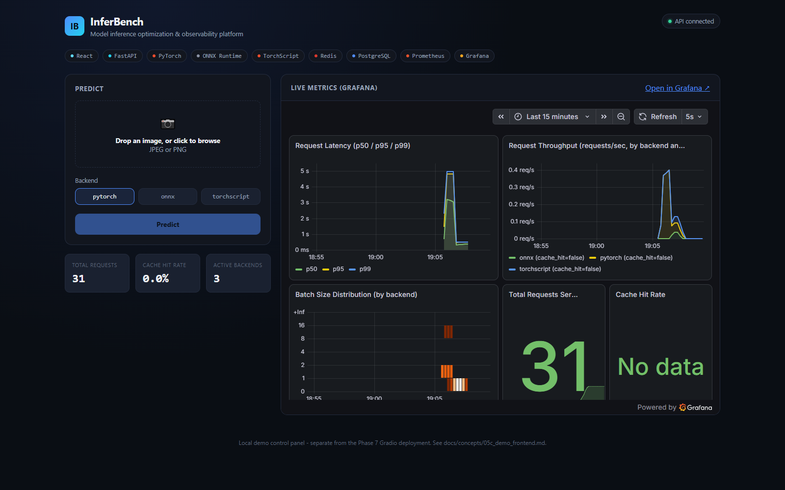
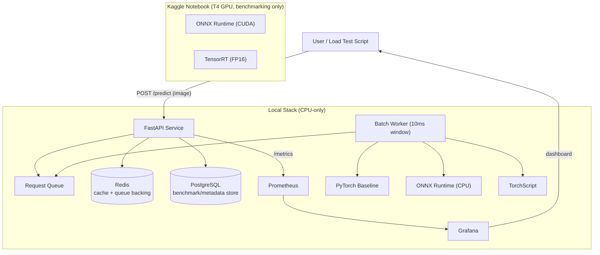
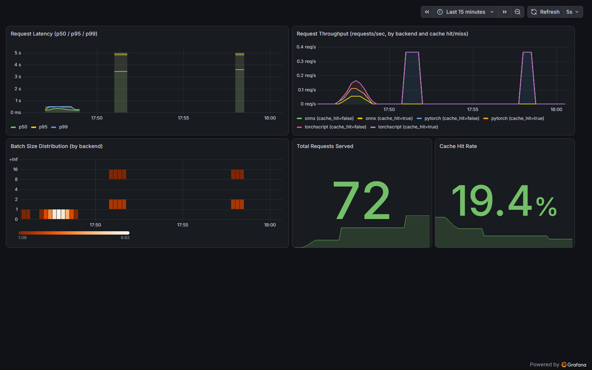
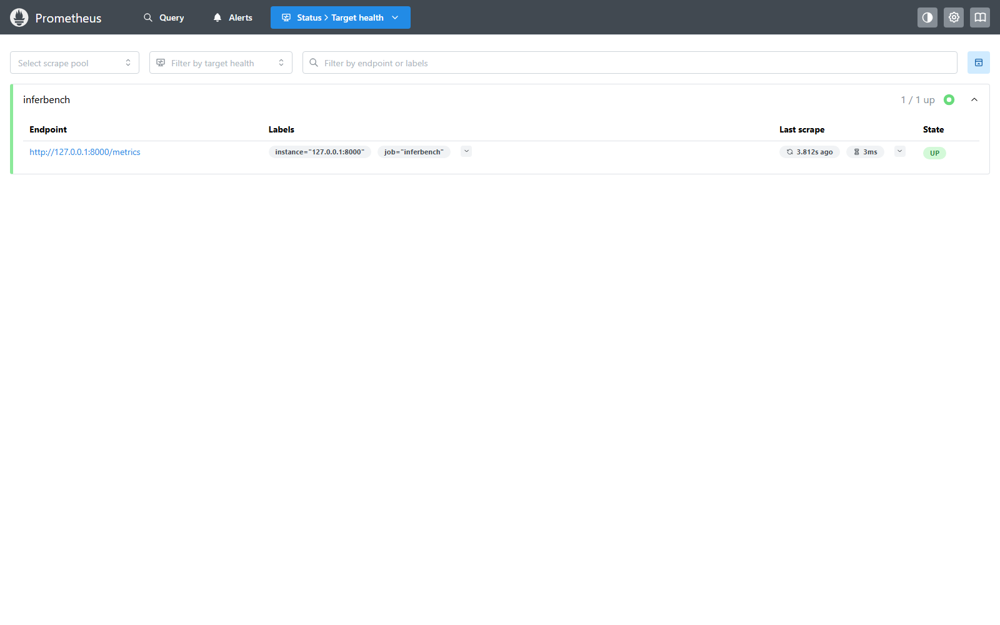

# InferBench

A self-serve model-inference optimization and observability platform. Upload
a model, get back a benchmarked, monitored inference endpoint, with real
before/after latency numbers across PyTorch, ONNX Runtime, and
TensorRT/TorchScript.

This build serves `google/vit-base-patch16-224` (ViT-Base), benchmarked on
both GPU (Kaggle T4) and CPU (local), and served through a FastAPI backend
with a dynamic batching layer built from scratch.


[](https://github.com/alyrraza/inference-benchmark-mlops/actions/workflows/ci.yml)

## Demo video

[](screenshots/inferbench_demo.mp4)

Click the image above (or [this link](screenshots/inferbench_demo.mp4)) to
watch a real prediction go through the stack, with the Grafana dashboard
updating live as it happens. Recorded using the local demo control panel
described in "Run it yourself" below - a local-only tool built
specifically for this recording, not a public deployment (this project
intentionally has no separate hosted demo - see "Project scope notes"
at the bottom for why).

## Architecture



The GPU benchmark (Kaggle) is offline, one-time work, its results are
already produced and just get referenced by the deployed CPU service, not
reproduced.

## Build status

| Phase | What | Status |
|---|---|---|
| 1 | CPU benchmarking (PyTorch / ONNX Runtime / TorchScript, batch 1-16) | Done |
| 2 | FastAPI service + dynamic batching layer built from scratch | Done |
| 3 | Redis response caching + GitHub Actions CI | Done |
| 4 | PostgreSQL benchmark/metadata store | Done |
| 5 | Prometheus + Grafana observability | Done |
| 6 | Docker Compose orchestration | Done* |
| 7 | ~~Gradio demo (Hugging Face Spaces)~~ | Skipped by design - see below |
| 8 | Final README + deployment | In progress |

*Phase 6 caveat: this machine has no Docker Desktop installed, so the
Docker Compose setup was designed and validated as thoroughly as
possible (YAML syntax, every cross-reference between services) but
could not be run end to end here. See
`docs/concepts/06b_phase6_walkthrough.md` for exactly what was and
wasn't verified, and what to check if you run it yourself.

Phase 7 was dropped intentionally: the local React demo frontend and
recorded video already satisfy the "show it working" need a second,
separately-deployed Gradio app would have duplicated. See "Project
scope notes" at the bottom.

## Results so far

**GPU (Kaggle, Tesla T4)** - see `kaggle/results/benchmark_results.json`:

| Batch size | PyTorch | ONNX Runtime (CUDA) | TensorRT FP16 | TRT speedup |
|---|---|---|---|---|
| 1  | 14.9ms  | 15.4ms  | 5.1ms  | 2.9x |
| 4  | 47.1ms  | 46.9ms  | 8.5ms  | 5.6x |
| 8  | 80.7ms  | 94.8ms  | 15.2ms | 5.3x |
| 16 | 166.9ms | 189.7ms | 32.5ms | 5.1x |

**CPU (local, this repo)** - see `benchmarks/results/cpu_benchmark_results.json`:

| Batch size | PyTorch (eager) | ONNX Runtime (CPU) | TorchScript |
|---|---|---|---|
| 1  | 263.2ms  | 280.3ms  | 306.7ms  |
| 4  | 945.2ms  | 1146.0ms | 1055.1ms |
| 8  | 1830.9ms | 2159.0ms | 2082.9ms |
| 16 | 3783.0ms | 4406.9ms | 4148.9ms |

Worth noting honestly: on this CPU, plain eager PyTorch was actually
faster than both ONNX Runtime and TorchScript at every batch size. That's
a real, measured result, not an error, format conversion is not an
automatic speedup, it depends on the hardware. TensorRT's GPU-specific
kernel fusion is what produced the large GPU-side win, there's no direct
CPU equivalent in this comparison.

## Observability

Live Grafana dashboard (provisioned from `grafana/dashboards/inferbench.json`,
not clicked together manually), showing real traffic from a concurrent
load test - latency percentiles, throughput by backend and cache hit/miss,
and the batch size distribution the dynamic batching worker actually formed:



Prometheus confirming it's actually scraping the service's `/metrics`
endpoint (not just configured to, genuinely up and current):



## Tech stack

- **React (Vite)** - local-only demo control panel for recording videos,
  see "Run it yourself" below (option 3) - not part of the locked backend
  architecture and not deployed anywhere
- **FastAPI** - REST API layer
- **PyTorch / ONNX Runtime / TorchScript** - three interchangeable CPU
  inference backends behind one common interface
- **A hand-built dynamic batching layer** - `asyncio.Queue` +
  `asyncio.Future`, no batching library
- **Redis** - response cache, keyed on a hash of the image bytes + backend
- **PostgreSQL** - `request_log` table storing backend, cache hit/miss,
  batch size, predicted class, latency, and timestamp for every request
- **Prometheus + Grafana** - latency histogram (p50/p95/p99), request
  counter, and batch-size histogram, scraped from `/metrics` every 5s and
  visualized on a dashboard provisioned entirely from version-controlled
  config
- **Docker Compose** - all five backend services (API, Redis, Postgres,
  Prometheus, Grafana) on one network, CPU-only, no GPU passthrough -
  see the Docker caveat in "Build status" above
- **GitHub Actions** - CI on every push/PR: installs dependencies, runs
  the pytest smoke suite against real Redis and PostgreSQL service
  containers

## Run it yourself

Three ways to run this, depending on what you want. If you just want to
see it work, use option 1. If you want to poke at individual services or
don't have Docker, use option 2. Option 3 is a separate, optional local
UI on top of whichever of the first two you're already running.

### 1. Quickest path: Docker Compose

**Requires Docker Desktop.** One command brings up the FastAPI service,
Redis, PostgreSQL, Prometheus, and Grafana together, networked, with
Grafana already pointed at Prometheus and the dashboard already
provisioned - no manual setup after this command finishes.

```powershell
git clone https://github.com/alyrraza/inference-benchmark-mlops.git
cd inference-benchmark-mlops
docker-compose up --build
```

First run takes a few minutes - the API image's build step downloads
ViT-Base's weights and exports the ONNX/TorchScript artifacts as part of
the build itself (see `docs/concepts/06_docker_compose_orchestration.md`
for why that happens at build time instead of being copied in).

Once it's up:

| Service | URL |
|---|---|
| API docs (Swagger UI) | http://127.0.0.1:8000/docs |
| API health check | http://127.0.0.1:8000/health |
| Prometheus | http://127.0.0.1:9090 |
| Grafana (login `admin`/`admin`) | http://127.0.0.1:3000 |

**Honesty note:** this machine has no Docker Desktop installed, so this
exact setup could be designed and validated (YAML syntax, every service/
network/volume cross-reference checked by hand) but not run end to end
here. `docs/concepts/06b_phase6_walkthrough.md` documents precisely
what was and wasn't verified, and exactly what to check if you run this
yourself - genuinely useful to read before assuming this path is
flawless.

### 2. Manual path: individual services, no Docker

What was actually used to build and test this project - useful if you
want to run without Docker, or dig into one component at a time.
Everything here uses portable, no-installer binaries and a local Python
virtual environment, kept off the C: drive throughout (see each phase's
own walkthrough doc under `docs/concepts/` for the full reasoning behind
every specific choice below).

**Python environment:**

```powershell
cd "D:\MLOps\Infer Bench"
python -m venv .venv
.venv\Scripts\python.exe -m pip install --index-url https://download.pytorch.org/whl/cpu torch torchvision
.venv\Scripts\python.exe -m pip install -r requirements.txt
```

**Redis** (optional - the service runs fine without it, every request
just becomes a cache miss):

```powershell
winget install Redis.Redis --accept-package-agreements --accept-source-agreements --silent
```

**PostgreSQL** (optional - the service runs fine without it, it just
stops recording request history). Portable binaries, not the installer,
so nothing registers as a Windows service and no admin rights are
needed:

```powershell
Invoke-WebRequest -Uri "https://get.enterprisedb.com/postgresql/postgresql-16.4-1-windows-x64-binaries.zip" -OutFile "postgresql-binaries.zip"
Expand-Archive -Path "postgresql-binaries.zip" -DestinationPath ".postgres\" -Force
Remove-Item "postgresql-binaries.zip"
.\.postgres\pgsql\bin\initdb.exe -D ".\.postgres-data" -U postgres -A trust --encoding=UTF8
.\.postgres\pgsql\bin\pg_ctl.exe -D ".\.postgres-data" -o "-p 5433" -l ".\.postgres-data\logfile.log" start
.\.postgres\pgsql\bin\createdb.exe -U postgres -p 5433 inferbench
```

**Prometheus and Grafana** (also optional, also portable binaries - see
`docs/concepts/05b_phase5_walkthrough.md` for a Grafana startup gotcha
worth knowing about before you hit it yourself):

```powershell
# Prometheus
Invoke-WebRequest -Uri "https://github.com/prometheus/prometheus/releases/download/v3.13.1/prometheus-3.13.1.windows-amd64.zip" -OutFile "prometheus.zip"
Expand-Archive -Path "prometheus.zip" -DestinationPath ".prometheus\" -Force
.\.prometheus\prometheus-3.13.1.windows-amd64\prometheus.exe --config.file="prometheus\prometheus.yml" --storage.tsdb.path=".prometheus-data" --web.listen-address=127.0.0.1:9090

# Grafana (separate terminal)
Invoke-WebRequest -Uri "https://dl.grafana.com/oss/release/grafana-13.1.0.windows-amd64.zip" -OutFile "grafana.zip"
Expand-Archive -Path "grafana.zip" -DestinationPath ".grafana\" -Force
$env:GF_PATHS_PROVISIONING = "$PWD\grafana\provisioning"
$env:GF_PATHS_DATA = "$PWD\.grafana-data"
.\.grafana\grafana-13.1.0\bin\grafana.exe server --homepath=".grafana\grafana-13.1.0"
```

Open `http://127.0.0.1:3000` (login `admin`/`admin`) - the dashboard is
already provisioned, no manual setup needed.

**Export the model artifacts** (only needed the first time):

```powershell
.venv\Scripts\python.exe benchmarks\export_torchscript.py
.venv\Scripts\python.exe benchmarks\export_onnx.py
```

**Run the tests:**

```powershell
$env:HF_HOME = "D:\MLOps\Infer Bench\.hf-cache"
.venv\Scripts\python.exe -m pytest tests\ -v
```

**Start the service:**

```powershell
.venv\Scripts\python.exe -m uvicorn app.main:app --host 127.0.0.1 --port 8000
```

**Test it** (in a second terminal):

```powershell
curl.exe -s http://127.0.0.1:8000/health
curl.exe -s -X POST "http://127.0.0.1:8000/predict?backend=pytorch" -F "file=@your_image.jpg;type=image/jpeg"
curl.exe -s http://127.0.0.1:8000/cache/stats
```

**Verification scripts**, each producing real proof, not just "it ran
with no errors" - see the matching phase's walkthrough doc for exactly
what each one showed when it was actually run during development:

```powershell
.venv\Scripts\python.exe scripts\load_test.py          # concurrent requests -> real batching
.venv\Scripts\python.exe scripts\verify_cache.py        # real cache miss, then real cache hit
.venv\Scripts\python.exe scripts\verify_db_logging.py   # real rows landing in PostgreSQL
```

### 3. Optional: the local demo frontend

`frontend/` is a small React (Vite) single-page app - a polished local
"mission control" panel built specifically for recording the demo video
above. It is **not** part of the locked backend architecture in
`docs/architecture_diagram.puml`, and this project has no separately
deployed public demo (see "Project scope notes" below for why) - this
only ever runs on `localhost`. See `docs/concepts/05c_demo_frontend.md`
for the full reasoning.

It has an upload-and-predict panel (drag-and-drop, backend selector,
animated results), a live stats strip, and the same Grafana dashboard
embedded via iframe so metrics update in real time as you make
predictions.

```powershell
cd frontend
npm install
npm run dev
```

Open `http://localhost:5173`. Requires the API to already be running
(either path above), with CORS enabled (on by default - see
`app/config.py`'s `CORS_ALLOWED_ORIGINS`) and, only if you want the
embedded dashboard panel to show live data, Grafana running with
`GF_SECURITY_ALLOW_EMBEDDING=true` and anonymous viewer access (not
needed for anything else in this project - see
`docs/concepts/05c_phase_frontend_walkthrough.md` for the exact launch
command and why those two settings specifically are safe here and would
not be in a real deployment).

## Project scope notes

- **No hosted public demo.** The original plan included a Gradio app on
  Hugging Face Spaces (this project's own kickoff notes called it
  "Phase 7"). It was dropped deliberately once the local React frontend
  and recorded demo video already covered the "show it working"
  need - a second, simpler, separately-deployed UI would have been
  redundant effort relative to the actual backend engineering work this
  project is about. If you want to see it run, either watch the demo
  video above or run it yourself with the instructions in this section.
- **Docker Compose is designed, not verified end to end.** Said plainly
  in "Build status" and above, and covered in full in
  `docs/concepts/06b_phase6_walkthrough.md` - this machine doesn't have
  Docker Desktop installed. Every other component in this repo was built
  and verified with real commands and real observed output.
- **`docs/concepts/*.md` referenced throughout this README are internal
  build notes, not part of this public repo.** They exist as this
  project's own working documentation (what/why/how for every component,
  plus a full command-by-command build log per phase) but were kept out
  of version control on purpose - some of the project's early planning
  notes included personal details not meant for a public audience, and
  the simplest safe choice was to keep the entire `docs/concepts/`
  folder local rather than curate it file by file. This README is the
  complete public account of what this project is and how to run it.
